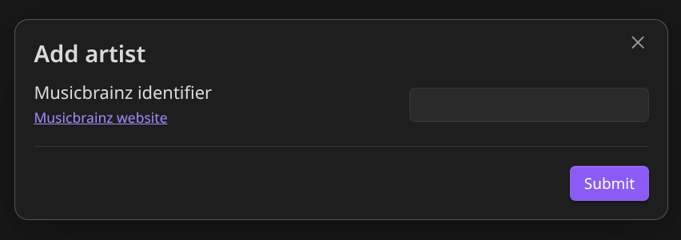
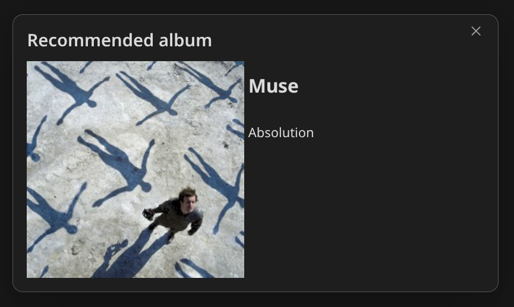

# Apollo for Obsidian

## Purpose

This plugin is designed to allow you to keep track of any artists that you have heard of and want to remember for the future.

The other primary feature is allowing you to discover albums by artists that you like, by using the "Recommend album" command.

## Usage

### Add artist

The `add-artist` command will provide the user with a Modal:

The user can then open up `https://musicbrainz.org/` and use their search functionality to find the artist they wish to add.

When the user submits the MusicBrainz ID of the Artist. Apollo will create a new file under `{DataFolder}/Artists` with the name given by MusicBrainz.
This file will contain information gathered on the Artist.

It will also generate a list in the `{DataFolder}/Artists.md` file, which contains all of the artists in the users storage.

### Refresh artists

The `refresh-artists` command simply looks at the list of artists in the `{DataFolder}/Artists` path and re-generates the `{DataFolder}/Artists.md` list as as index of the artists saved.

### Recommend album

The `recommend-album` command will pick an artist from the users library at random, and then select one of the saved Albums from that artist.

It will then display a modal to the user with the album cover (provided by [Cover art archive](#coverartarchive)), as well as the artist name and album name

## Network Use

This plugin communicates with both [MusicBrainz](#musicbrainz) and the [CoverArt Archive](#coverartarchive) to power it's functionality.

### MusicBrainz

[Website](https://musicbrainz.org/)

This plugin uses MusicBrainz to query data based on the ID provided by the user of the plugin.

The `add-artist` command is currently the only command that interacts with Musicbrainz

### CoverArtArchive

[Website](https://coverartarchive.org/)

This plugin uses the Cover Art Archive to display Album covers to the user.

The `recommend-album` command is currently the only command that interacts with the Cover Art Archive.
